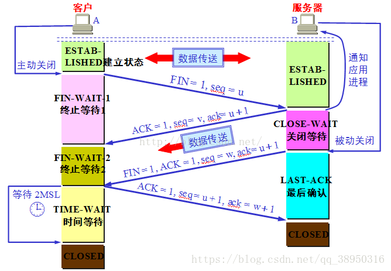

# [面试]TCP QA 
## 1 面向连接的可靠传输
保证可靠传输主要是靠停等协议和序号约定。  
为了提高传输效率，在停等协议的基础上加了滑动窗口，和累计确认机制。其中具体有选择重传和 GBN 等处理方式。
## 2 拥塞控制  
- **慢开始**  
当主机开始发送数据时，如果立即所大量数据字节注入到网络，那么就有可能引起网络拥塞。    
这个时候以一个很小的量试探，如果发现网络还可以，那么就继续加大传输量，直到遇到超时。    
具体来说是要先把拥塞窗口设置为一个报文段 MSS 的值，每次正常传输接受 ACK 后把这个窗口大小翻倍。     
- **拥塞避免** 
当慢开始算法的窗口大小达到窗口阈值的时候，将采用拥塞避免算法线性增加窗口大小，一次增加一个 MSS 。  
- **快重传**   
快重传算法首先要求接收方每收到一个失序的报文段就立即发出重复确认（为的是使发送方及早知道有报文段没有到达对方），然后若是发送方接收到3个重复确认 ACK ，则启动快重传算法，不必等到该报文段的计时器超时。  
- **快恢复**  
收到三个重复的ACK会让拥塞窗口大小减半，阈值减半，继续执行拥塞避免算法，而不会直接到慢开始算法。
## 3 连接建立和结束
- **三次握手**
   
- **四次挥手**

## 4 常见问题
- **4.1 为什么需要三次握手，两次握手行不行？**  
三次握手是为了让双方做好发送数据的工作。如果改成两次握手会无法确认接受方发送消息的起始序列号，因为对接受方其实序列号确认的ACK消息可能会在网络中丢失。  
- **4.2 为什么需要四次挥手？**  
四次挥手是为了让双方都知道可以释放连接了。和连接建立不同，三次握手的第二次握手既带了 ACK 又带了接收方的序号，两者连接的建立是同步的。连接释放的时候，一方发送完毕后，另一方可能还有消息要发送，两方的释放过程是非同步的。所以需要两次确认，四次挥手。
- **4.3 TIME_WAIT状态需要经过2MSL才能返回到CLOSE状态？**  
四次挥手的最后一个确认报文可能会丢失，当确认报文丢失的时候，另一方会超时重传。如果 2MSL 没有重传的报文，就认为对方已经接受到了。2MSL 是一个发送和一个回复所需要的最大时间。同时也是为了占用当前连接的序号，让所有该链接的包都过期失效。  
- **4.4 大量TIME_WAIT会有什么问题？如何解决？**
**导致的问题：** 大量的TIME_WAIT状态会占用客户端的端口，服务器端的句柄fd,导致新的连接进不来。
[解决方法参考](https://blog.csdn.net/qq100440110/article/details/52267708)  
**解决方法总结：**
    - 改变短连接为长连接（TCP HTTP保活机制）
    - 一个四元组对应一个TCP连接表的slot，增加四元组的个数，源端口数量增加，目的IP增加，目的端口监听个数增加。
    - tcp_tw_reuse，配合时间戳使用，时间戳如果在当前时间之前，那就回一个RST表示连接已经重置。如何时间戳在后面，那么直接复用之前的元组。
    - tcp_tw_recycle 拒绝时间戳非递增请求的连接。