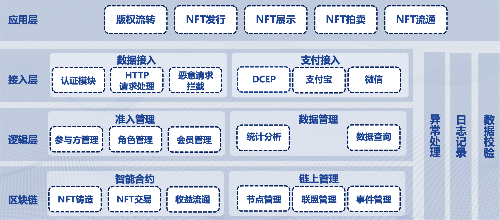
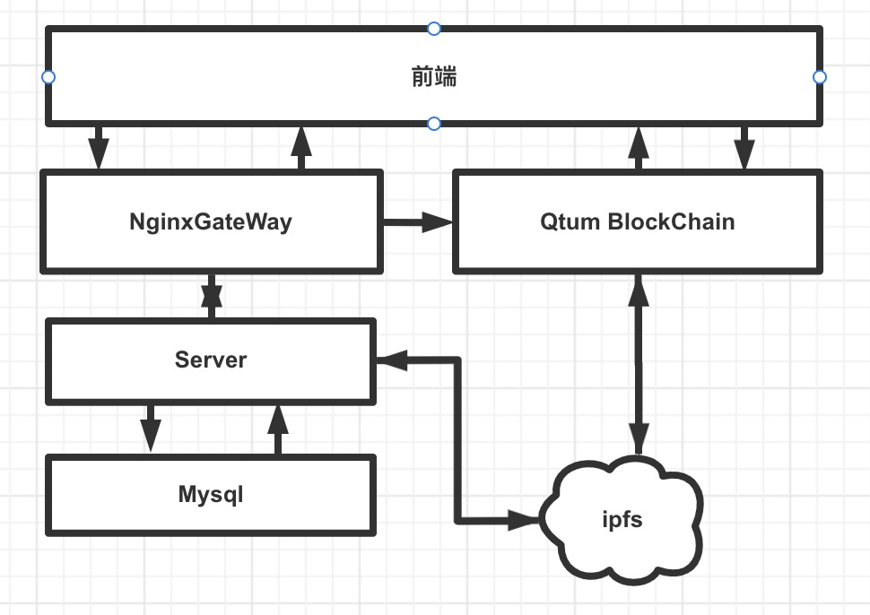
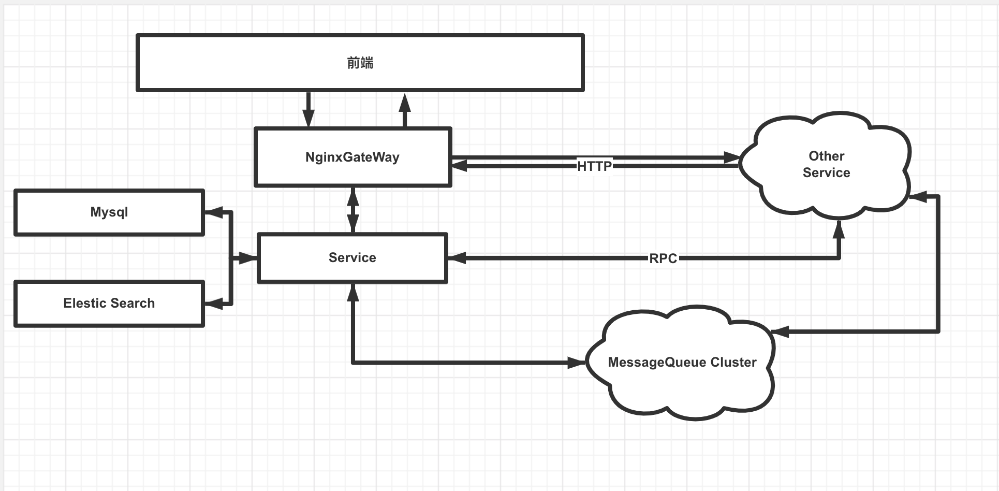

# 实践报告  
## 1 万象区块链大赛作品 链影 - 基于Qtum量子链的电影NFT交易平台
### 1.1 项目简介
链影是一个基于Qtum的NFT电影和数字艺术品交易平台。改善电影行业营收过于单一，电影衍生品收入比重低的问题，向国际电影产业营收来源丰富的业态靠齐。平台主要将电影的汇编权等二次创作权益，衍生艺术品，衍生的相关电子收藏品NFT化后放入平台交易。通过收益回流，有效解决版权滥用和侵权改编等行为，鼓励文艺创作者进行创作。同时平台化后，所有交易透明，有利于税务局税务治理。
### 1.2 逻辑架构设计
 
#### 1.2.1 链化 
- 对电影版权进行NFT化，上链后版权进行交易后，将按照收成比例将二次创作收入自动回流进版权方。
- 对电子艺术品进行NFT化，上链后电子艺术品将被赋予NFT地址，成为独一无二的token，天然和收藏品的属性相和，极具有防伪的能力。
- 对电影票进行NFT化，和上文收藏品类似，每张电影票都对应着一个地址，具有防伪和收藏的属性。
#### 1.2.2 平台化
- 将所有交易集中到平台上，方便地进行一键购买等操作。
- 用户所有的交易过程全部是前段和链直接交互，极大保证了安全性。
- 所有数据公开透明，基于区块链的所有交易都是可查可追溯透明的，极大了打击了非法逃税的行为。

#### 1.3 物理架构
  
传统的前后端分离架构。
- 前端 主要负责信息的展示和用户直接交易和链上交互。
- 后端 进行一些电影信息，艺术品信息的缓存操作，实现业务逻辑，传递前端数据。
- Qtum BlockChain 只能合约主要的运行载体，交易平台的区块链实现方案。
- ipfs 艺术品等电子艺术品存储地，分布式文件系统，安全，防伪能力强。  

## 2 企业实践 跨校资源平台后台
### 2.1 工程简介
响应国家双减的号召，促进在线教育为学校服务。资源平台为了学校的老师服务，个性化提供教案，课件和老师的信息，提供点赞，推荐检索等功能，极大了方便了老师的备课和教学。
### 2.2 设计和实现

### 2.2.1 微服务架构
- 作为整个校企合作工程的一部分，是众多微服务中的一个。
- 和其他微服务进行交互，交互方式主要为RPC调用和消息队列。
- 服务通过k8s部署成docker实例。主从模式。
### 2.2.2 数据源
- 教案课件等信息来源：其他服务同步而来。
- 同步方式：kafka监听binlog , MQ订阅模式消费同步消息。
- 数据存储：元数据入数据库，大文件进入OSS服务。
### 2.2.3 搜索与查询
- 数据库查询，进行数据库优化，可以实现短时间内查询最热门资源。
- ES搜索，将元数据进行Index化存入ES，使用倒排索引直接加速。
- 相关资源推荐，根据知识点划分，学科相关性进行匹配，优化上述两种方案，结合实际业务需求实现快速查询。

