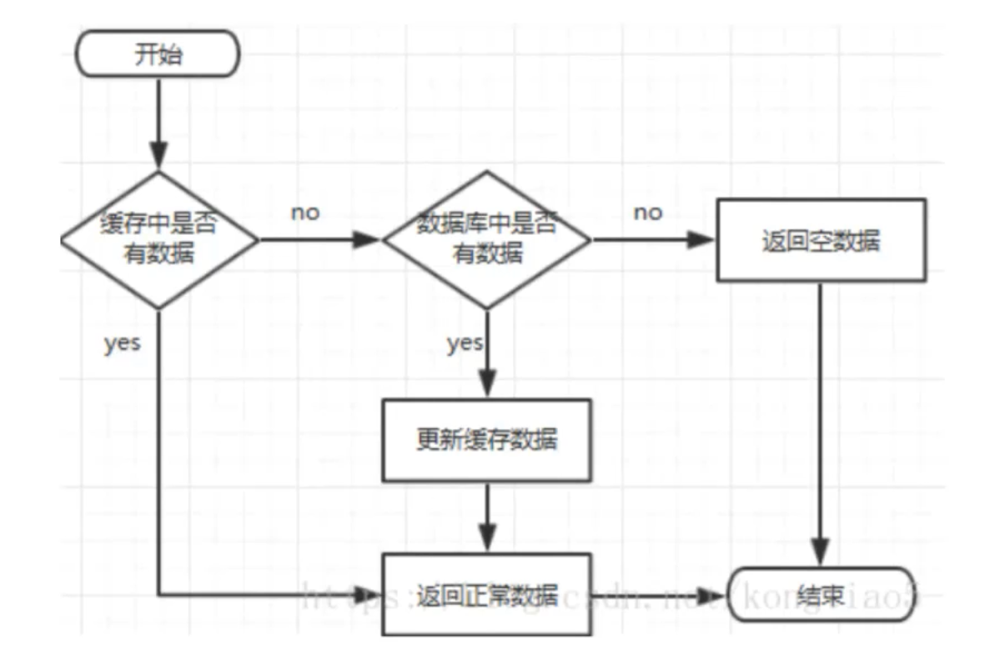

#### Redis 三个常见问题
##### 缓存穿透
- 问题描述：
当用户访问缓存以及数据库中不存在的数据，就会绕过缓存，直接查询数据库信息。由于查询的结果不存在，故而查询结果不会存在缓存中，这样，下次同样的请求到来，需要继续进行这样一个过程。这个过程直接穿透缓存，耗费数据库资源。
{:height="50%" width="50%"}
- 问题解决方案：
当来到一个数据库中不存在的查询时，在缓存中设置该查询的key，并且将value设置为null。将该缓存的有效时间设置短一些，大约30秒，也防止攻击用户用1个id暴力攻击。
##### 缓存雪崩
- 问题描述：
在某一个时间段内，缓存集中过期失效。这样查询都落到了数据库上，数据库会产生周期性的压力波峰。
- 问题解决方案：
设置不同的过期时间。
冷门数据的过期时间设置短一点，热门数据的过期时间设置长一点。甚至特别热门的数据过期时间直接设成永久。
##### 缓存击穿
- 问题描述：
指的是一个特别热点的key，在不停地抗着大并发，这个key失效后，持续大并发击穿缓存，直接请求到数据库。
- 问题解决方案：
对于特别热点的key甚至永远不过期。
